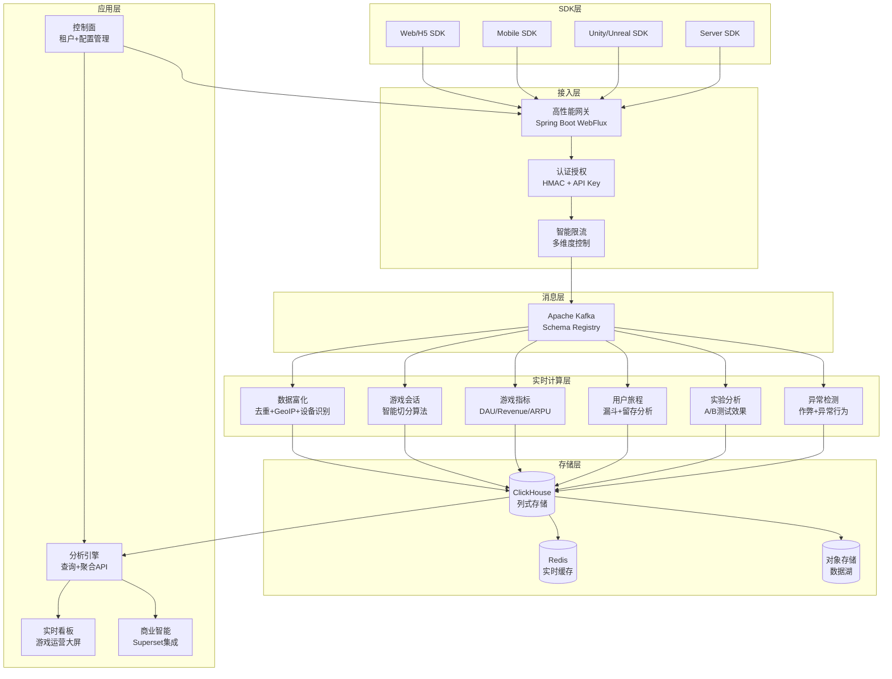

# 🎮 Pit - 专业游戏分析平台

企业级多租户游戏数据分析平台，为游戏公司提供实时数据采集、智能分析和商业洞察。

## ✨ 核心特性

### 🏢 多租户架构
- **组织级隔离**: 支持游戏公司、发行商的完全数据隔离
- **游戏级管理**: 每个游戏独立配置、独立分析
- **环境隔离**: 开发/测试/生产环境完全分离
- **灵活计费**: 按数据量、API调用次数等多维度计费

### 🎯 游戏专业化分析
- **玩家生命周期**: 获取→激活→留存→货币化→推荐 (AARRR)
- **实时指标监控**: DAU/MAU、ARPU/ARPPU、留存率、流失预警
- **用户行为分析**: 游戏会话、关卡进度、付费路径、社交互动
- **商业智能**: 收入分析、虚拟经济平衡、A/B测试效果评估

### 🚀 高性能数据处理
- **毫秒级延迟**: 事件采集到可见 < 5秒
- **海量并发**: 单节点 >10k events/sec，线性扩展
- **精确计算**: Exactly-once 语义，端到端数据一致性
- **实时流处理**: Apache Flink 驱动的复杂事件处理

### 🔒 企业级安全治理
- **数据隐私保护**: PII自动识别和脱敏处理
- **访问控制**: 细粒度 RBAC 权限管理
- **审计追踪**: 完整的数据访问和操作日志
- **合规支持**: GDPR、CCPA 等隐私法规遵从

## 🏗️ 技术架构



## 🚀 快速开始

### 环境要求
- Java 21+
- Docker & Docker Compose
- 8GB+ 内存

### 一键部署
```bash
# 完整端到端演示
bash scripts/e2e.sh

# 导入预置的游戏分析看板
bash scripts/superset-import.sh
```

### 本地开发
```bash
# 启动基础设施
docker-compose -f infra/docker-compose.yml up -d

# 启动网关服务
./gradlew :services:gateway-service:bootRun

# 启动控制面服务
./gradlew :services:control-service:bootRun

# 启动 Flink 作业
bash scripts/run_flink.sh
```

## 📊 核心游戏指标

### 用户获取 (Acquisition)
- **新用户注册**: 每日新增用户数和趋势
- **渠道分析**: 各推广渠道的用户质量和转化成本
- **归因追踪**: 用户来源的精确归因和 ROI 分析

### 用户激活 (Activation)
- **首次体验**: 新手教程完成率和关键行为转化
- **功能采用**: 核心游戏功能的使用率和深度
- **快速价值实现**: 用户感知到游戏价值的时间点

### 用户留存 (Retention)
- **经典留存**: 次日、7日、30日留存率曲线
- **分层留存**: 按付费状态、等级、行为特征分层分析
- **留存预测**: 基于用户行为预测流失风险

### 用户变现 (Revenue)
- **付费转化**: 免费用户到付费用户的转化路径
- **收入指标**: ARPU、ARPPU、LTV 等关键商业指标
- **虚拟经济**: 游戏内货币流通和道具消费分析

### 用户推荐 (Referral)
- **社交传播**: 用户邀请和分享行为分析
- **病毒系数**: 用户自然增长的驱动力量化
- **口碑监测**: 用户评价和推荐意愿跟踪

## 🎯 使用场景

### 游戏运营团队
- **实时监控**: 游戏关键指标的实时大屏监控
- **异常告警**: 收入下降、用户流失等异常情况及时通知
- **趋势分析**: 长期趋势识别和季节性模式发现

### 产品经理
- **功能分析**: 新功能上线效果评估和用户反馈收集
- **A/B测试**: 产品优化方案的对比实验和效果评估
- **用户画像**: 深度用户行为分析和个性化推荐

### 数据分析师
- **深度挖掘**: 自定义查询和复杂数据分析
- **模型构建**: 用户生命周期价值预测和流失预警模型
- **业务洞察**: 数据驱动的商业决策支持

### 技术团队
- **性能监控**: 游戏服务器性能和用户体验监控
- **错误追踪**: 客户端崩溃和服务异常的自动收集分析
- **容量规划**: 基于用户增长的基础设施扩容规划

## 📚 文档中心

### 架构设计
- [系统架构详解](docs/architecture.zh.md) - 深入了解技术架构设计
- [数据模型设计](docs/data-model.zh.md) - 游戏数据建模最佳实践
- [多租户架构](docs/multi-tenant.zh.md) - 企业级多租户设计方案

### 开发指南
- [快速接入指南](docs/quickstart.zh.md) - 5分钟完成首次数据上报
- [SDK 开发文档](docs/sdk-guide.zh.md) - 各平台 SDK 详细使用说明
- [API 参考手册](docs/api-reference.zh.md) - 完整的 API 接口文档

### 运维部署
- [本地开发环境](docs/development.zh.md) - 搭建本地开发调试环境
- [生产环境部署](docs/production.zh.md) - 高可用生产环境部署指南
- [Kubernetes 部署](docs/k8s-deployment.zh.md) - 容器化部署最佳实践
- [监控运维指南](docs/monitoring.zh.md) - 系统监控和故障排查

### 业务应用
- [游戏分析最佳实践](docs/game-analytics.zh.md) - 游戏行业分析方法论
- [实验平台使用](docs/experiments.zh.md) - A/B测试平台完整指南
- [数据安全合规](docs/data-privacy.zh.md) - 数据隐私保护实施指南

## 🛠️ 技术栈

### 核心技术
- **后端框架**: Spring Boot 3 + WebFlux (响应式编程)
- **消息队列**: Apache Kafka 3.x + Schema Registry
- **流处理引擎**: Apache Flink 1.19 (实时计算)
- **数据存储**: ClickHouse 24.x (列式数据库)
- **缓存系统**: Redis 7.x (高速缓存)

### 基础设施
- **容器化**: Docker + Kubernetes
- **服务网格**: Istio (可选)
- **监控体系**: OpenTelemetry + Prometheus + Grafana
- **日志聚合**: ELK Stack / Loki
- **配置管理**: Spring Cloud Config / K8s ConfigMap

### 开发工具
- **构建工具**: Gradle 8.x (多模块项目)
- **代码质量**: SonarQube + SpotBugs
- **CI/CD**: GitHub Actions / GitLab CI
- **API 文档**: OpenAPI 3.0 + Swagger UI

## 🤝 贡献指南

我们欢迎社区贡献！请查看 [贡献指南](docs/contributing.zh.md) 了解详细流程。

### 贡献方式
- 🐛 提交 Bug 报告
- 💡 提出新功能建议
- 📝 改进文档
- 🔧 提交代码补丁
- 🧪 编写测试用例

## 📜 开源协议

本项目采用 [Apache License 2.0](LICENSE) 开源协议。

## 🌟 Star History

如果这个项目对您有帮助，请给我们一个 ⭐️ 支持！

## 💬 社区支持

- 📚 讨论交流: [GitHub Discussions](https://github.com/your-org/pit/discussions)
- 🐛 问题反馈: [GitHub Issues](https://github.com/your-org/pit/issues)
