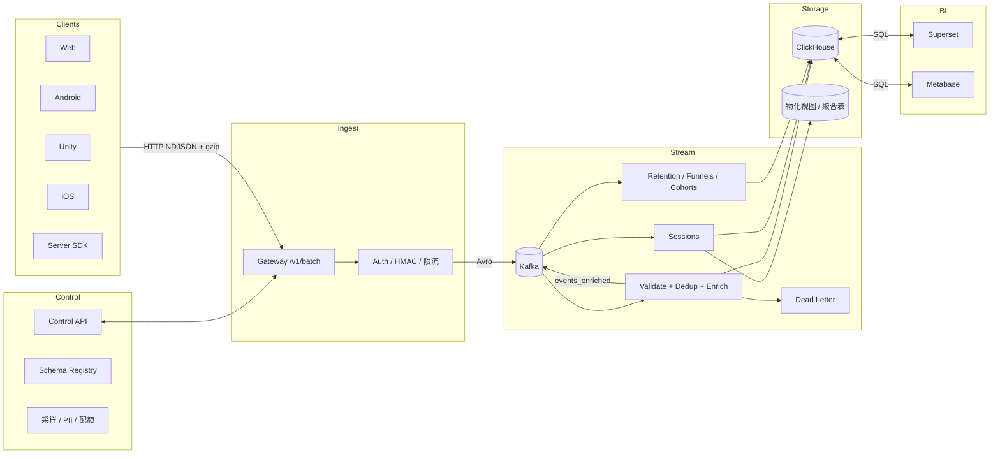

# Playtics 全 Java 架构（Monorepo）

目标：统一 Java 技术栈，提供高吞吐采集、实时/离线计算、快速查询与完善治理；优先 ClickHouse 存储。

关键设计
- 幂等/去重：客户端 `uuidv7` 作为 `event_id`；Flink 按 `event_id` 去重（状态 TTL 7d）。
- 乱序/迟到：事件时间 + Watermark（如 10 分钟）；迟到数据旁路补写。
- Exactly-once：Kafka→Flink→ClickHouse 使用 2PC/幂等写入策略。
- 存储建模：ClickHouse 以项目+月份分区，`props_json` JSON 列避免 schema 爆炸；物化视图生成留存/漏斗等指标。
- 安全治理：项目级 API Key + HMAC；PII 白名单/掩码；速率限制与采样策略由控制面下发。
- 可观测：OpenTelemetry（Java Agent+代码）→ Collector → 存储（CH/Prom/Grafana）。

组件与语言
- Java 21；Spring Boot 3(WebFlux/Netty)；Kafka 3；Flink 1.19；ClickHouse 24；Avro；Schema Registry（Apicurio 推荐）。

目录（Monorepo）
- `build.gradle.kts`、`settings.gradle.kts`：根构建与依赖对齐
- `schema/`：Avro/JSON Schema、ClickHouse DDL
- `libs/`：公共库（model、auth、kafka、otel、utils）
- `services/`：微服务（gateway-service、control-service）
- `jobs/flink/`：Flink 作业（events-enrich、sessions、retention、funnels）
- `bi/`：Superset/Metabase 资源
- `infra/`：本地/部署编排（Kafka、ClickHouse、Registry、OTel）
- `docs/`：架构、API、SDK 设计

数据模型（核心字段）
- 基础：`event_id,event_name,project_id,device_id,user_id?,session_id?,ts_client,ts_server`
- 环境：`platform,app_version,locale,country,os,device_model,net_type`
- 归因：`campaign,source,medium,ad_group`
- 计费：`currency,amount,item_id,quantity`
- 实验：`exposures=[{exp,variant,ts}]`
- 自定义：`props_json`（层级≤3，体积限额）
- 观测：`trace_id,span_id`（可选）

SLA/容量（示例）
- 入口吞吐：>= 10k events/sec（单副本）
- 延迟：入口→CH 可见 P50 < 5s；端到端 exactly-once
- 成本：CH 冷热分层，原始保留 30～90 天；聚合长保留

演进
- 首期：events-enrich + sessions + 常用 MV（留存/DAU/漏斗）
- 二期：实验平台/特征库、Streaming Join、回溯重算管道

## 常见问题

为什么有了 Kafka 还需要 Flink？
- Kafka 是消息队列/日志，不做有状态计算；Flink 负责去重（event_id/状态TTL）、会话切分、窗口聚合、乱序/迟到数据处理、流表 Join、Exactly-once 端到端语义。
- 仅用 ClickHouse 物化视图可覆盖部分聚合，但对乱序/迟到与复杂状态计算（会话/漏斗）成本更高，且难以做到精确一次。
- 结论：Kafka 负责可靠传递与回压；Flink 负责实时有状态计算；ClickHouse 负责查询与长期存储。

Schema Registry 选型：Apicurio vs Confluent
- 推荐 Apicurio（开源、自管轻量，支持 Avro/JSON Schema/Protobuf）。当前仓库已接入：
  - Gateway 生产端：`io.apicurio.registry.serde.avro.AvroKafkaSerializer`
  - Flink 消费端：`jobs/flink/events-enrich-job/.../ApicurioAvroFlinkDeserializer.java`
- 如已使用 Confluent 生态，也可切换：
  - 生产端改为 `io.confluent.kafka.serializers.KafkaAvroSerializer`
  - 消费端改为 Confluent 反序列化器；同时调整 subject 命名策略与兼容性级别
- 二者在协议上兼容“magic byte + schema id”思路，但管理 API/配置有差异。自管场景下 Apicurio 成本更低；已有 Confluent 平台则沿用即可。
