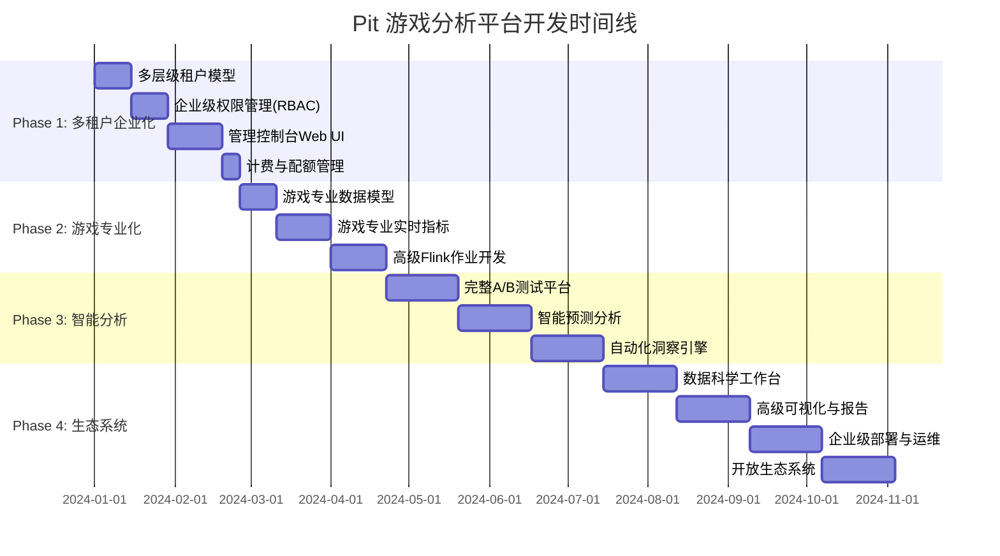

# 🎮 Pit 游戏分析平台产品路线图

**目标愿景**: 成为业界领先的专业游戏分析平台，为游戏公司提供从数据采集到商业洞察的完整解决方案。

---

## 📊 当前状态评估 (v0.1.x)

### ✅ 已完成的核心能力

#### 🏗️ 基础架构层 (95% 完成)
- ✅ **数据采集链路**: SDK → Gateway → Kafka → Flink → ClickHouse
- ✅ **多平台SDK**: Web、Android、iOS、Unity、Server SDK
- ✅ **高性能网关**: Spring Boot WebFlux，支持 >10k events/sec
- ✅ **实时流处理**: 4个核心Flink作业 (富化、会话、留存、漏斗)
- ✅ **列式存储**: ClickHouse 优化的游戏事件表结构
- ✅ **监控体系**: OpenTelemetry + Prometheus + Grafana

#### 🔒 安全治理层 (80% 完成)
- ✅ **API认证**: API Key + HMAC 签名验证
- ✅ **数据隐私**: PII自动识别和脱敏 (邮箱、电话、IP)
- ✅ **访问控制**: 项目级API Key隔离
- ✅ **限流保护**: 多维度限流 (API Key + IP)
- 🟡 **审计日志**: 基础审计，需要增强

#### 📈 分析能力层 (60% 完成)
- ✅ **基础指标**: DAU、会话分析、基础留存
- ✅ **BI集成**: Superset 仪表盘和图表
- 🟡 **游戏专业指标**: 部分完成，需要扩展
- ❌ **实验平台**: 基础曝光记录，缺少完整A/B测试能力
- ❌ **智能分析**: 缺少预测分析、异常检测

### 🔍 关键差距分析

1. **多租户能力不足**: 当前仅支持项目级隔离，缺少组织级管理
2. **游戏专业化欠缺**: 通用分析为主，游戏行业特色不够突出
3. **自助服务能力弱**: 缺少用户友好的配置和管理界面
4. **智能化程度低**: 主要是基础统计，缺少AI驱动的洞察

---

## 🚀 产品路线图规划

### 🎯 Phase 1: 多租户企业化 (v0.2.0) - 预计6-8周

**目标**: 构建企业级多租户管理能力，支持游戏公司的组织化运营

#### 1.1 多层级租户模型 (2周)
```yaml
优先级: P0 (必须完成)
负责模块: Control Service + Gateway
```

**新增核心实体**:
- 🏢 **Organization**: 游戏公司/发行商
- 🎮 **Game**: 具体游戏产品
- 🌍 **Environment**: 开发/测试/生产环境
- 👥 **User**: 平台用户和权限管理

**数据库模型设计**:
```sql
-- 组织表
CREATE TABLE organizations (
    id VARCHAR(32) PRIMARY KEY,
    name VARCHAR(100) NOT NULL,
    display_name VARCHAR(200),
    tier ENUM('free', 'pro', 'enterprise') DEFAULT 'free',
    created_at TIMESTAMP DEFAULT CURRENT_TIMESTAMP
);

-- 游戏表
CREATE TABLE games (
    id VARCHAR(32) PRIMARY KEY,
    org_id VARCHAR(32) REFERENCES organizations(id),
    name VARCHAR(100) NOT NULL,
    genre ENUM('action', 'rpg', 'strategy', 'casual', 'other'),
    platform SET('web', 'mobile', 'pc', 'console'),
    created_at TIMESTAMP DEFAULT CURRENT_TIMESTAMP
);

-- 用户表
CREATE TABLE users (
    id VARCHAR(32) PRIMARY KEY,
    email VARCHAR(255) UNIQUE NOT NULL,
    name VARCHAR(100),
    role ENUM('super_admin', 'org_admin', 'game_admin', 'analyst', 'viewer'),
    org_id VARCHAR(32) REFERENCES organizations(id)
);
```

#### 1.2 企业级权限管理 (RBAC) (2周)
```yaml
优先级: P0
负责模块: Control Service + Web UI
```

**权限模型**:
- 🔑 **Super Admin**: 平台超级管理员
- 🏢 **Org Admin**: 组织管理员 (管理组织内所有游戏)
- 🎮 **Game Admin**: 游戏管理员 (管理特定游戏)
- 📊 **Analyst**: 数据分析师 (只读分析权限)
- 👁️ **Viewer**: 观察者 (基础查看权限)

**功能实现**:
- JWT token 认证体系
- 细粒度权限控制 API
- 用户邀请和激活流程

#### 1.3 管理控制台 Web UI (3周)
```yaml
优先级: P0
技术栈: React + TypeScript + Ant Design
```

**核心页面**:
- 🏠 **Dashboard**: 组织概览和关键指标
- 🏢 **组织管理**: 组织信息、成员管理
- 🎮 **游戏管理**: 游戏创建、配置、环境管理
- 🔑 **API Key管理**: 密钥生成、权限配置、使用监控
- 👥 **用户管理**: 邀请用户、角色分配
- ⚙️ **系统设置**: PII策略、限流配置

#### 1.4 计费与配额管理 (1周)
```yaml
优先级: P1
负责模块: Control Service + Gateway
```

**计费维度**:
- 📊 **事件数量**: 按月事件采集量
- 🔗 **API调用**: 查询API调用次数
- 💾 **存储容量**: 数据存储空间使用
- ⏱️ **数据保留**: 数据保留时长

### 🎮 Phase 2: 游戏专业化分析 (v0.3.0) - 预计8-10周

**目标**: 深度游戏行业定制，提供专业的游戏分析能力

#### 2.1 游戏专业数据模型 (2周)
```yaml
优先级: P0
负责模块: Schema + Flink Jobs + ClickHouse
```

**扩展事件模型**:
```sql
-- 游戏专业事件表
CREATE TABLE events_gaming (
    -- 基础标识
    event_id String,
    event_name String,
    org_id String,
    game_id String,
    env String,

    -- 用户标识
    device_id String,
    user_id Nullable(String),
    player_id Nullable(String),        -- 游戏内玩家ID

    -- 游戏专属字段
    player_level Nullable(Int32),      -- 玩家等级
    vip_level Nullable(Int32),         -- VIP等级
    server_id Nullable(String),        -- 游戏服务器
    guild_id Nullable(String),         -- 公会ID

    -- 货币化
    currency String DEFAULT 'USD',
    revenue Nullable(Decimal(10,2)),   -- 真实货币收入
    virtual_currency Nullable(String), -- 虚拟货币类型
    virtual_amount Nullable(Int64),    -- 虚拟货币数量

    -- 游戏行为
    game_mode Nullable(String),        -- 游戏模式
    level_id Nullable(String),         -- 关卡ID
    match_id Nullable(String),         -- 对局ID
    item_id Nullable(String),          -- 道具ID

    -- 时间与分区
    ts_client DateTime64(3),
    ts_server DateTime64(3) DEFAULT now64(3),
    partition_date Date MATERIALIZED toDate(ts_server)

) ENGINE = MergeTree()
PARTITION BY (org_id, game_id, toYYYYMM(ts_server))
ORDER BY (game_id, player_id, ts_server);
```

#### 2.2 游戏专业实时指标 (3周)
```yaml
优先级: P0
负责模块: Flink Jobs + ClickHouse Views
```

**核心游戏指标体系**:

1. **用户获取 (Acquisition)**:
   - 新用户注册率和趋势
   - 渠道转化率分析
   - 用户获取成本 (CAC)

2. **用户激活 (Activation)**:
   - 新手教程完成率
   - 首次关键行为转化
   - Time-to-Value 分析

3. **用户留存 (Retention)**:
   - 经典留存 (D1/D7/D30)
   - 分层留存 (付费/等级/行为)
   - 流失预警模型

4. **用户变现 (Revenue)**:
   - 付费转化率
   - ARPU/ARPPU 分析
   - 生命周期价值 (LTV)

5. **用户推荐 (Referral)**:
   - 社交传播分析
   - 病毒系数计算
   - 口碑监测

#### 2.3 高级Flink作业开发 (3周)
```yaml
优先级: P0
技术栈: Apache Flink 1.19 + CEP
```

**新增专业分析作业**:

1. **游戏会话智能分析**:
   - 基于游戏行为的智能会话切分
   - 会话质量评分算法
   - 异常会话检测

2. **玩家行为序列分析**:
   - 关卡进度追踪
   - 付费路径分析
   - 游戏内经济流动

3. **实时异常检测**:
   - 作弊行为识别
   - 异常付费模式检测
   - 游戏平衡性监控

### 🧠 Phase 3: 智能分析与实验平台 (v0.4.0) - 预计10-12周

**目标**: 引入AI驱动的智能分析和完整的A/B测试平台

#### 3.1 完整A/B测试平台 (4周)
```yaml
优先级: P0
负责模块: Control Service + SDK + Analytics
```

**实验管理能力**:
- 实验创建、配置、发布
- 多变量测试支持
- 受众定向和流量分配
- 实验效果实时监控
- 统计显著性检验

#### 3.2 智能预测分析 (4周)
```yaml
优先级: P1
技术栈: Python + Scikit-learn + TensorFlow
```

**预测模型**:
- 用户流失预测
- 生命周期价值预测
- 付费倾向预测
- 游戏内行为预测

#### 3.3 自动化洞察引擎 (4周)
```yaml
优先级: P1
负责模块: Analytics Engine + AI Service
```

**智能功能**:
- 异常检测和自动告警
- 趋势分析和预测
- 个性化推荐
- 自动化报告生成

### 🌟 Phase 4: 生态系统与高级功能 (v0.5.0) - 预计12-16周

**目标**: 构建完整的游戏分析生态系统

#### 4.1 数据科学工作台 (4周)
- Jupyter Notebook 集成
- 自定义查询构建器
- 数据导出和API
- 第三方工具集成

#### 4.2 高级可视化与报告 (4周)
- 交互式仪表盘
- 自定义图表库
- 定时报告系统
- 移动端支持

#### 4.3 企业级部署与运维 (4周)
- 多云部署支持
- 灾备和高可用
- 性能调优工具
- 企业级安全增强

#### 4.4 开放生态系统 (4周)
- 开放API平台
- 第三方插件系统
- 社区贡献机制
- 合作伙伴集成

---

## 📅 实施时间线



---

## 🎯 成功指标 (KPIs)

### 技术指标
- **性能**: 采集延迟 < 100ms, 查询响应 < 2s
- **可用性**: SLA 99.9%+, 故障恢复 < 5min
- **扩展性**: 支持千万级DAU, 万亿级事件
- **准确性**: 数据准确率 99.99%+

### 业务指标
- **用户采用**: 月活跃游戏公司 100+
- **数据规模**: 日处理事件 10亿+
- **客户满意**: NPS > 50, 续费率 > 90%
- **生态健康**: API调用 1000万+/月

---

## ⚠️ 风险评估与应对

### 高风险项
1. **技术复杂度**: AI模型的准确性和性能
   - **应对**: 分阶段实施，先MVP后优化
2. **数据合规性**: 各国隐私法规差异
   - **应对**: 内置多地区合规模板
3. **客户接入**: 大客户的定制化需求
   - **应对**: 预留扩展点，模块化设计

### 中等风险项
1. **团队扩张**: 快速增长的人员管理
2. **基础设施**: 云成本控制和优化
3. **竞争压力**: 行业内其他解决方案

---

## 🛠️ 资源需求规划

### 研发团队 (按Phase 1估算)
- **后端工程师**: 3人 (Java/Spring/Flink)
- **前端工程师**: 2人 (React/TypeScript)
- **数据工程师**: 2人 (ClickHouse/Kafka)
- **产品经理**: 1人
- **测试工程师**: 1人
- **DevOps工程师**: 1人

### 基础设施
- **开发环境**: 云服务器 + 存储
- **测试环境**: 压测环境 + 数据
- **生产环境**: 高可用集群部署

---

## 📋 下一步行动

基于当前评估，我建议立即开始 **Phase 1.1: 多层级租户模型** 的开发工作。这是后续所有功能的基础，优先级最高。

您希望我开始实施哪个具体模块？我可以：
1. 🏗️ 设计和实现多租户数据库模型
2. 🔑 开发企业级权限管理系统
3. 🎨 创建管理控制台Web界面
4. 📊 扩展游戏专业化数据模型

请选择一个模块，我将立即开始详细的设计和实现工作。
